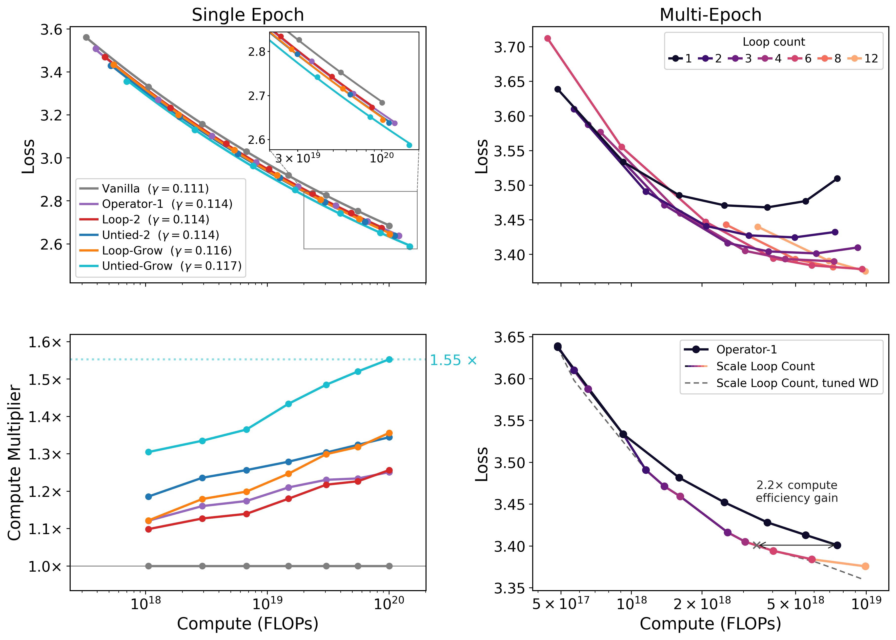

# How Model Growth, Recursion, and Boundary Operators Influence Scaling Exponents

The repository contains the code for the paper **How Model Growth, Recursion, and Boundary Operators Influence Scaling Exponents** by Zixi Chen, Akshay Vegesna, Samip Dahal, and Andrew Gordon Wilson.



[Figures](#figures) · [Training logs](#public-ladder-runs) · [Checkpoints](#pretrained-checkpoints)

## Setup

Use Python 3.10+ and H100 GPUs. The paper's standard ladders use one node with
8 GPUs; Untied-Grow d26 uses two nodes with 16 GPUs total.

```bash
uv sync --frozen
source .venv/bin/activate
```

Dependencies are pinned in `uv.lock`. FlashAttention-3 downloads its pinned kernel
on first use. Training logs to W&B offline by default; no W&B account is needed.

## Data

Prepare either corpus with the pinned dataset revision below. Each command writes
`train.pt`, `val.pt`, and a provenance manifest, `corpus.json`, to the output directory.
A 30B-token pool uses about 60 GB, plus space and host RAM for preparation.

```bash
# FineWeb
python prepare_corpus.py --corpus fineweb \
  --revision 9bb295ddab0e05d785b879661af7260fed5140fc \
  --out data/fineweb --train-tokens 30000000000

# FineWeb-Edu
python prepare_corpus.py --corpus fineweb-edu \
  --revision 87f09149ef4734204d70ed1d046ddc9ca3f2b8f9 \
  --out data/fineweb_edu --train-tokens 40000000000
```

<details>
<summary>Tokenization and validation splits</summary>

Both corpora use GPT-2 tokenization. FineWeb is the default corpus.

- **FineWeb:** validation uses the first 10M tokens from `sample-10BT`. Training
  uses `sample/100BT`, excluding documents whose signature matches a validation
  document. The signature is a SHA-1 hash of up to 64 body tokens.
- **FineWeb-Edu:** shards from `sample/100BT` are sorted by filename. The first
  shard supplies a 10.2M-token validation pool and is excluded from training;
  the remaining shards supply training tokens in order.

`corpus.json` records the resolved dataset revision, tokenizer and package
versions, token and offset hashes, and shard provenance.

</details>

## Reproduce the ladders

Run commands from the repository root. Each script in `ladder_scripts/` trains a
complete architecture ladder; `bash -e` stops on the first failed run.

```bash
# FineWeb (default dataset)
bash -e ladder_scripts/vanilla.sh

# FineWeb-Edu
export DATA_DIR=data/fineweb_edu
export RUNS_DIR=runs/fineweb_edu
export WANDB_GROUP=fineweb_edu
bash -e ladder_scripts/vanilla.sh
bash -e ladder_scripts/untied_grow.sh
```

`DATA_DIR` selects the folder containing `train.pt` and `val.pt`; `RUNS_DIR` selects
where results are saved. Defaults are `data/fineweb`, `runs`, eight GPUs per node
(`NPROC_PER_NODE`), and the W&B group `scaling_ladders` (`WANDB_GROUP`). Use a fresh
`RUNS_DIR` when repeating an experiment.

<details>
<summary>Ladder scripts and recipes</summary>

Each standard ladder has 7 or 8 runs. TPP is the token-to-parameter ratio;
`d` is the paper's depth coordinate.

| Script | Architecture | Depth coordinates | TPP | LR exponent |
| --- | --- | --- | ---: | ---: |
| `vanilla.sh` | Vanilla | 6–20, even | 5 | 0.8 |
| `deep_vanilla.sh` | Deep Vanilla | 6–18, even | 6 | 0.7 |
| `operator_1.sh` | Operator-1 | 6–20, even | 6 | 0.6 |
| `loop_2.sh` | Loop-2 | 6–18, even | 6 | 0.6 |
| `untied_2.sh` | Untied-2 | 6–18, even | 6 | 0.6 |
| `loop_grow.sh` | Loop-Grow | 6–18, even | 7 | 0.5 |
| `untied_grow.sh` | Untied-Grow | 6–18, even | 8 | 0.6 |
| `untied_grow_d26.sh` | Untied-Grow extrapolation | 26 only | 8 | 0.6 |

Width is `128d` and the number of attention heads is `d`. The prelude/core/coda
split divides `d` into thirds, with any remainder assigned to the core and then
the coda. Deep Vanilla executes the same number of layers as Untied-2.

Learning rates follow `LR(d) = 0.04 × (N(8)/N(d))^exponent`, where `N` includes
embedding and output-head parameters. Growth uses the initial K=2 parameter count.
Fixed-depth runs use `round(TPP × N / 524288)` optimizer steps. Growth runs match
the initial K=2 matrix-compute budget, switch from K=2 to K=4, and re-warm the
learning rate for 40 steps. Final validation uses the final K.

All runs use bfloat16, a 2,048-token context, and 524,288 tokens per optimizer step.
Exact settings and step counts are written in each script.

</details>

<details id="untied-grow-on-fineweb-edu">
<summary>Untied-Grow d26 on FineWeb-Edu: two-node launch</summary>

The d26 run uses width 3,328, 26 heads, and an 8/9/9 prelude/core/coda split.
At 77% of training it grows from K=2 to K=4, increasing active parameters from
about 5.0B to 7.4B. All 7.4B parameters are allocated at initialization.

On **both nodes**, set the dataset and output paths:

```bash
export DATA_DIR=data/fineweb_edu
export RUNS_DIR=runs/fineweb_edu
export WANDB_GROUP=fineweb_edu
```

Replace `node0` with node 0's reachable address. Use the same address and port
on both nodes, and run the matching command on each:

```bash
# Node 0
NNODES=2 NODE_RANK=0 MASTER_ADDR=node0 MASTER_PORT=29500 NPROC_PER_NODE=8 \
  bash -e ladder_scripts/untied_grow_d26.sh

# Node 1
NNODES=2 NODE_RANK=1 MASTER_ADDR=node0 MASTER_PORT=29500 NPROC_PER_NODE=8 \
  bash -e ladder_scripts/untied_grow_d26.sh
```

</details>

## Reproduce data-constrained scaling

The four scripts in [`data_constrained_scripts/`](data_constrained_scripts/) reproduce the scaling recipes in the third panel of Figure 5: Operator-1 and recurrence scaling, each with fixed or K=1-selected weight decay. They use a 100M-token FineWeb pool for 10 epochs.

## Evaluate CORE accuracy and NLL

Evaluate a final checkpoint on one H100 GPU:

```bash
CUDA_VISIBLE_DEVICES=0 python eval.py \
  --checkpoint runs/vanilla_d08/checkpoints/final.pt
```

The default evaluation uses all **91,037 examples across 22 CORE tasks**, with
few-shot seeds **0, 1, 2**. It downloads and verifies the benchmark bundle on first
use; training data is not needed. Results are saved to the run's `eval.json`.

For a [published checkpoint](#pretrained-checkpoints), download both `final.pt`
and `result.json`, then pass their paths explicitly:

```bash
CUDA_VISIBLE_DEVICES=0 python eval.py \
  --checkpoint path/to/final.pt --result-json path/to/result.json \
  --out path/to/eval.json
```

<details>
<summary>Evaluation protocol and output metrics</summary>

Evaluation uses GPT-2 tokenization, the checkpoint's context length (2,048 in the
paper), bfloat16, FlashAttention-3, and the final recurrence count (K=4 for growth
runs). Seeds change the few-shot demonstrations; benchmark examples stay fixed.
Zero-shot results are reused across seeds. Scores are averaged over seeds within
each task, then equally across tasks.

| JSON key | Meaning |
| --- | --- |
| `core_metric` | Full CORE accuracy: average of `(accuracy − chance) / (1 − chance)` over all 22 tasks; higher is better. |
| `core_loss` | CORE answer NLL in nats/token: mean loss over the full correct-answer continuation, averaged over examples within each task, then equally over all 22 tasks; lower is better. Prompt tokens are excluded. |
| `core_metric_filtered` | Mean centered accuracy on the paper's frozen 17-task subset. This excludes CommonsenseQA, BoolQ, and BIG-bench CS Algorithms, Language Identification, and Repeat Copy Logic. |
| `core_metric_std` | Population standard deviation of full CORE accuracy across evaluation seeds. |

Multiple-choice tasks select the candidate with the lowest mean token loss.
Language-modeling accuracy requires every reference token to be predicted
correctly. Answer NLL scores the full gold answer, including any prefix shared
by the choices, and excludes prompt tokens.

Use `--bundle-dir` to select a benchmark directory (default `eval_bundle/`) and
`--out` to select the results file. The evaluator checks the bundle against the
paper's recorded content fingerprint.

</details>

## Figures

Regenerate all 24 main-text and appendix figures from bundled data:

```bash
bash plotting_scripts/make_all.sh
```

See [plotting instructions](plotting_scripts/README.md) for dependencies,
individual figures, and plotting your own runs. Outputs go to
`plotting_scripts/pdf/` and `plotting_scripts/png/`.

## Public ladder runs

Click a **final validation loss** (lower is better) to open the run in
[loop-ladder-pub on W&B](https://wandb.ai/zc2157/loop-ladder-pub). Values are rounded
to four decimals; rows use the depth coordinate `d`. A dash means no run at that depth.

<details>
<summary>FineWeb training logs — 58 runs across eight ladders</summary>

| Depth | Vanilla | Deep Vanilla | Deep Vanilla Grow | Operator-1 | Loop-2 | Untied-2 | Loop-Grow | Untied-Grow |
| --- | ---: | ---: | ---: | ---: | ---: | ---: | ---: | ---: |
| d6 | [3.5609](https://wandb.ai/zc2157/loop-ladder-pub/runs/97cbb61ce8be970c) | [3.4500](https://wandb.ai/zc2157/loop-ladder-pub/runs/2afced384d9fbaec) | [3.4347](https://wandb.ai/zc2157/loop-ladder-pub/runs/1696a0d39b7947b1) | [3.5075](https://wandb.ai/zc2157/loop-ladder-pub/runs/b8071fb51dcce5e6) | [3.4685](https://wandb.ai/zc2157/loop-ladder-pub/runs/78289161e1c0bacd) | [3.4286](https://wandb.ai/zc2157/loop-ladder-pub/runs/5022f97d98aedd7b) | [3.4325](https://wandb.ai/zc2157/loop-ladder-pub/runs/6982392b38ccb053) | [3.3551](https://wandb.ai/zc2157/loop-ladder-pub/runs/224d2d251b5904af) |
| d8 | [3.3296](https://wandb.ai/zc2157/loop-ladder-pub/runs/e34833ec1874f9ed) | [3.2121](https://wandb.ai/zc2157/loop-ladder-pub/runs/84f4b9f30b8d6564) | [3.1963](https://wandb.ai/zc2157/loop-ladder-pub/runs/a31dc0071066a0c1) | [3.2697](https://wandb.ai/zc2157/loop-ladder-pub/runs/56380104242ce991) | [3.2323](https://wandb.ai/zc2157/loop-ladder-pub/runs/09716eabb000d4fd) | [3.1904](https://wandb.ai/zc2157/loop-ladder-pub/runs/6804040ef1acbf9a) | [3.2002](https://wandb.ai/zc2157/loop-ladder-pub/runs/48f9fade0d60e8f4) | [3.1304](https://wandb.ai/zc2157/loop-ladder-pub/runs/5f9554d5b6726ec1) |
| d10 | [3.1562](https://wandb.ai/zc2157/loop-ladder-pub/runs/f6355478fa84fb64) | [3.0394](https://wandb.ai/zc2157/loop-ladder-pub/runs/681551c579d74e30) | [3.0237](https://wandb.ai/zc2157/loop-ladder-pub/runs/3115c91b02776909) | [3.1016](https://wandb.ai/zc2157/loop-ladder-pub/runs/a52a664bcea6b52d) | [3.0662](https://wandb.ai/zc2157/loop-ladder-pub/runs/37fa9cc5d2c795ba) | [3.0190](https://wandb.ai/zc2157/loop-ladder-pub/runs/d75ae392a555e173) | [3.0357](https://wandb.ai/zc2157/loop-ladder-pub/runs/98cef288e324a3cd) | [2.9625](https://wandb.ai/zc2157/loop-ladder-pub/runs/d60a194176a051cb) |
| d12 | [3.0292](https://wandb.ai/zc2157/loop-ladder-pub/runs/365027f1a4dd9910) | [2.9292](https://wandb.ai/zc2157/loop-ladder-pub/runs/fa997e9562e8c459) | [2.9140](https://wandb.ai/zc2157/loop-ladder-pub/runs/b0909bb2a89e33a4) | [2.9790](https://wandb.ai/zc2157/loop-ladder-pub/runs/abd3c6fed621d1d0) | [2.9473](https://wandb.ai/zc2157/loop-ladder-pub/runs/5550ca9b15e1812e) | [2.9077](https://wandb.ai/zc2157/loop-ladder-pub/runs/41f90bcb9eebe9e6) | [2.9184](https://wandb.ai/zc2157/loop-ladder-pub/runs/ee7c19043debfff4) | [2.8509](https://wandb.ai/zc2157/loop-ladder-pub/runs/280255f8b5c9443d) |
| d14 | [2.9190](https://wandb.ai/zc2157/loop-ladder-pub/runs/6064f7338318ab34) | [2.8194](https://wandb.ai/zc2157/loop-ladder-pub/runs/892fbd689b04453c) | [2.8019](https://wandb.ai/zc2157/loop-ladder-pub/runs/ff96fa6ccb2cd503) | [2.8663](https://wandb.ai/zc2157/loop-ladder-pub/runs/82cd995a7b7dca9f) | [2.8341](https://wandb.ai/zc2157/loop-ladder-pub/runs/57105ff34b73efe7) | [2.7940](https://wandb.ai/zc2157/loop-ladder-pub/runs/3830136bcc6a86d1) | [2.8046](https://wandb.ai/zc2157/loop-ladder-pub/runs/6d9210edba4a2cc6) | [2.7416](https://wandb.ai/zc2157/loop-ladder-pub/runs/952068ffa17449bd) |
| d16 | [2.8259](https://wandb.ai/zc2157/loop-ladder-pub/runs/dd577b422af3eafa) | [2.7265](https://wandb.ai/zc2157/loop-ladder-pub/runs/5c46db1767ad1c74) | [2.7077](https://wandb.ai/zc2157/loop-ladder-pub/runs/f5bf4dbc36adc843) | [2.7775](https://wandb.ai/zc2157/loop-ladder-pub/runs/40e6a532a8f0013b) | [2.7427](https://wandb.ai/zc2157/loop-ladder-pub/runs/12857e0377497565) | [2.7018](https://wandb.ai/zc2157/loop-ladder-pub/runs/e098f854e791b636) | [2.7154](https://wandb.ai/zc2157/loop-ladder-pub/runs/da7c0b57c73c3816) | [2.6509](https://wandb.ai/zc2157/loop-ladder-pub/runs/d7c58fa961289d01) |
| d18 | [2.7523](https://wandb.ai/zc2157/loop-ladder-pub/runs/3f1bcdc0f788f0d0) | [2.6625](https://wandb.ai/zc2157/loop-ladder-pub/runs/b6962d3134d378b1) | [2.6429](https://wandb.ai/zc2157/loop-ladder-pub/runs/e812e69f22174928) | [2.7044](https://wandb.ai/zc2157/loop-ladder-pub/runs/b8a31348452f81d2) | [2.6731](https://wandb.ai/zc2157/loop-ladder-pub/runs/fd05ed7bc3af1e4e) | [2.6378](https://wandb.ai/zc2157/loop-ladder-pub/runs/38894d2e191c350c) | [2.6445](https://wandb.ai/zc2157/loop-ladder-pub/runs/8016feafab0affc7) | [2.5870](https://wandb.ai/zc2157/loop-ladder-pub/runs/6413059c8f6a98f8) |
| d20 | [2.6834](https://wandb.ai/zc2157/loop-ladder-pub/runs/2ca3569eb6a1bff3) | — | — | [2.6373](https://wandb.ai/zc2157/loop-ladder-pub/runs/985b8a222830f02a) | — | — | — | — |

Deep Vanilla Grow is an additional paper baseline. The seven scripts in
`ladder_scripts/` cover the other columns.

</details>

<details>
<summary>FineWeb-Edu training logs — Vanilla and Untied-Grow, including d26</summary>

| Depth | Vanilla | Untied-Grow |
| --- | ---: | ---: |
| d6 | [3.3367](https://wandb.ai/zc2157/loop-ladder-pub/runs/459db54627134c58) | [3.1348](https://wandb.ai/zc2157/loop-ladder-pub/runs/ca775944a64733a7) |
| d8 | [3.1048](https://wandb.ai/zc2157/loop-ladder-pub/runs/3fab0952296cb053) | [2.9011](https://wandb.ai/zc2157/loop-ladder-pub/runs/0db747cfbef3a1e5) |
| d10 | [2.9288](https://wandb.ai/zc2157/loop-ladder-pub/runs/8062b3739fc3bcb9) | [2.7345](https://wandb.ai/zc2157/loop-ladder-pub/runs/cef5abc2134fc265) |
| d12 | [2.8035](https://wandb.ai/zc2157/loop-ladder-pub/runs/cd84da7adc14754e) | [2.6244](https://wandb.ai/zc2157/loop-ladder-pub/runs/e7678678b69ae766) |
| d14 | [2.6915](https://wandb.ai/zc2157/loop-ladder-pub/runs/6f052e40e7900e27) | [2.5110](https://wandb.ai/zc2157/loop-ladder-pub/runs/2473c69cec2dc539) |
| d16 | [2.5989](https://wandb.ai/zc2157/loop-ladder-pub/runs/997627a2b503cb8e) | [2.4230](https://wandb.ai/zc2157/loop-ladder-pub/runs/040d46fad181efed) |
| d18 | [2.5235](https://wandb.ai/zc2157/loop-ladder-pub/runs/a2a16fa83b82597e) | [2.3592](https://wandb.ai/zc2157/loop-ladder-pub/runs/74ffe17b7235e2d5) |
| d20 | [2.4529](https://wandb.ai/zc2157/loop-ladder-pub/runs/bc67a4cb7f30b34b) | — |
| d26 | — | [2.1372](https://wandb.ai/zc2157/loop-ladder-pub/runs/2f1ba770756c22c1) |

Untied-Grow d26 is the **7.42B-parameter** extrapolation run. See the
[two-node launch instructions](#untied-grow-on-fineweb-edu) to reproduce it.

</details>

## Pretrained checkpoints

Click a **full 22-task CORE score** (`core_metric`, higher is better) to open its
checkpoint on Hugging Face. Scores are the paper's mean chance-normalized
accuracies, rounded to four decimals. A dash means no checkpoint is published.

<details>
<summary>FineWeb checkpoints — 51 models across seven ladders</summary>

| Depth | Vanilla | Deep Vanilla | Operator-1 | Loop-2 | Untied-2 | Loop-Grow | Untied-Grow |
| --- | ---: | ---: | ---: | ---: | ---: | ---: | ---: |
| d6 | [0.0731](https://huggingface.co/CharlieChen/loop-vanilla-d6) | [0.0683](https://huggingface.co/CharlieChen/loop-deep-vanilla-d6) | [0.0856](https://huggingface.co/CharlieChen/loop-operator-1-d6) | [0.0761](https://huggingface.co/CharlieChen/loop-2-d6) | [0.0915](https://huggingface.co/CharlieChen/loop-untied-2-d6) | [0.0938](https://huggingface.co/CharlieChen/loop-grow-d6) | [0.1076](https://huggingface.co/CharlieChen/loop-untied-grow-d6) |
| d8 | [0.0968](https://huggingface.co/CharlieChen/loop-vanilla-d8) | [0.1016](https://huggingface.co/CharlieChen/loop-deep-vanilla-d8) | [0.1011](https://huggingface.co/CharlieChen/loop-operator-1-d8) | [0.1198](https://huggingface.co/CharlieChen/loop-2-d8) | [0.1294](https://huggingface.co/CharlieChen/loop-untied-2-d8) | [0.1284](https://huggingface.co/CharlieChen/loop-grow-d8) | [0.1420](https://huggingface.co/CharlieChen/loop-untied-grow-d8) |
| d10 | [0.1342](https://huggingface.co/CharlieChen/loop-vanilla-d10) | [0.1454](https://huggingface.co/CharlieChen/loop-deep-vanilla-d10) | [0.1430](https://huggingface.co/CharlieChen/loop-operator-1-d10) | [0.1482](https://huggingface.co/CharlieChen/loop-2-d10) | [0.1486](https://huggingface.co/CharlieChen/loop-untied-2-d10) | [0.1565](https://huggingface.co/CharlieChen/loop-grow-d10) | [0.1848](https://huggingface.co/CharlieChen/loop-untied-grow-d10) |
| d12 | [0.1331](https://huggingface.co/CharlieChen/loop-vanilla-d12) | [0.1855](https://huggingface.co/CharlieChen/loop-deep-vanilla-d12) | [0.1476](https://huggingface.co/CharlieChen/loop-operator-1-d12) | [0.1612](https://huggingface.co/CharlieChen/loop-2-d12) | [0.1740](https://huggingface.co/CharlieChen/loop-untied-2-d12) | [0.1855](https://huggingface.co/CharlieChen/loop-grow-d12) | [0.1993](https://huggingface.co/CharlieChen/loop-untied-grow-d12) |
| d14 | [0.1773](https://huggingface.co/CharlieChen/loop-vanilla-d14) | [0.2127](https://huggingface.co/CharlieChen/loop-deep-vanilla-d14) | [0.1899](https://huggingface.co/CharlieChen/loop-operator-1-d14) | [0.1981](https://huggingface.co/CharlieChen/loop-2-d14) | [0.2110](https://huggingface.co/CharlieChen/loop-untied-2-d14) | [0.2074](https://huggingface.co/CharlieChen/loop-grow-d14) | [0.2182](https://huggingface.co/CharlieChen/loop-untied-grow-d14) |
| d16 | [0.2111](https://huggingface.co/CharlieChen/loop-vanilla-d16) | [0.2348](https://huggingface.co/CharlieChen/loop-deep-vanilla-d16) | [0.2266](https://huggingface.co/CharlieChen/loop-operator-1-d16) | [0.2132](https://huggingface.co/CharlieChen/loop-2-d16) | [0.2255](https://huggingface.co/CharlieChen/loop-untied-2-d16) | [0.2388](https://huggingface.co/CharlieChen/loop-grow-d16) | [0.2603](https://huggingface.co/CharlieChen/loop-untied-grow-d16) |
| d18 | [0.2220](https://huggingface.co/CharlieChen/loop-vanilla-d18) | [0.2469](https://huggingface.co/CharlieChen/loop-deep-vanilla-d18) | [0.2327](https://huggingface.co/CharlieChen/loop-operator-1-d18) | [0.2425](https://huggingface.co/CharlieChen/loop-2-d18) | [0.2665](https://huggingface.co/CharlieChen/loop-untied-2-d18) | [0.2568](https://huggingface.co/CharlieChen/loop-grow-d18) | [0.2865](https://huggingface.co/CharlieChen/loop-untied-grow-d18) |
| d20 | [0.2454](https://huggingface.co/CharlieChen/loop-vanilla-d20) | — | [0.2478](https://huggingface.co/CharlieChen/loop-operator-1-d20) | — | — | — | — |

</details>

<details>
<summary>FineWeb-Edu checkpoints — Vanilla and Untied-Grow, including d26</summary>

| Depth | Vanilla | Untied-Grow |
| --- | ---: | ---: |
| d6 | [0.0799](https://huggingface.co/CharlieChen/loop-fwe-vanilla-d6) | [0.1073](https://huggingface.co/CharlieChen/loop-fwe-untied-grow-d6) |
| d8 | [0.0861](https://huggingface.co/CharlieChen/loop-fwe-vanilla-d8) | [0.1523](https://huggingface.co/CharlieChen/loop-fwe-untied-grow-d8) |
| d10 | [0.1344](https://huggingface.co/CharlieChen/loop-fwe-vanilla-d10) | [0.1788](https://huggingface.co/CharlieChen/loop-fwe-untied-grow-d10) |
| d12 | [0.1699](https://huggingface.co/CharlieChen/loop-fwe-vanilla-d12) | [0.2103](https://huggingface.co/CharlieChen/loop-fwe-untied-grow-d12) |
| d14 | [0.1753](https://huggingface.co/CharlieChen/loop-fwe-vanilla-d14) | [0.2518](https://huggingface.co/CharlieChen/loop-fwe-untied-grow-d14) |
| d16 | [0.2101](https://huggingface.co/CharlieChen/loop-fwe-vanilla-d16) | [0.2871](https://huggingface.co/CharlieChen/loop-fwe-untied-grow-d16) |
| d18 | [0.2378](https://huggingface.co/CharlieChen/loop-fwe-vanilla-d18) | [0.3118](https://huggingface.co/CharlieChen/loop-fwe-untied-grow-d18) |
| d20 | [0.2595](https://huggingface.co/CharlieChen/loop-fwe-vanilla-d20) | — |
| d26 | — | [0.3865](https://huggingface.co/CharlieChen/loop-fwe-untied-grow-d26) |

</details>

## Acknowledgments and license

This project is released under the [MIT License](LICENSE).

The optimizer builds on [Nanochat](https://github.com/karpathy/nanochat) and
[modded-nanogpt](https://github.com/KellerJordan/modded-nanogpt); the CORE evaluator
is adapted from Nanochat. The license retains Andrej Karpathy's copyright notice
for the Nanochat-derived portions. The prepared token-pool format was inspired by
[Slowrun](https://github.com/qlabs-eng/slowrun).
